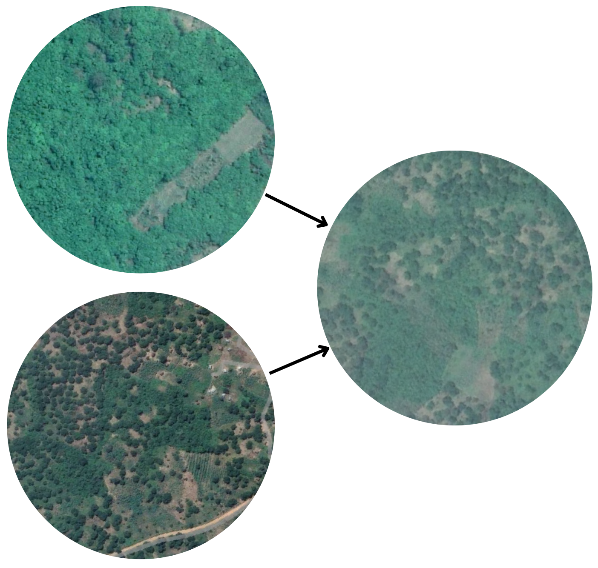

# Bridging domains: Assessment of Domain Adaptation methods for mapping Cashew crops in Africa

This repository contains all of the code used for my MSc. thesis, which can be found [here](https://www.dropbox.com/scl/fi/cvioui35atli96pfxpkhj/MGI_Thesis_Report_DominguezDuran_Martin.pdf?rlkey=q5s62shwle3nge81en5f4glnb&dl=0).

  

## Objective
The overall objective of this thesis was to assess the performance of **adversarial domain adaptation techniques** for increasing the **generalization capabilities** of deep learning models for **Cashew crop mapping**.

# Research questions
1.  *What are the underlying factors contributing to the domain shift between source and target and how much does it affect the accuracy of a cashew crop mapping model trained only with source data and applied in the target domain?*
**Short answer:** 
    - The domain shift can be influenced by seasonal environmental variations, differences in cultivation practices, and potential sensor characteristic variations. 
    - The segmentation models in the cross-domain scenario exhibited a notorious decrease in model performance, which indicates a substantial gap in conditional probability distributions between detecting cashew crops in Tanzania and Ivory Coast.

2. *To what extent do adversarial domain adaptation methods impact the accuracy and the generalization capability of semantic segmentation models used for cashew crop mapping?*
**Short answer:**
    - The application of domain adaptation methods to the cashew dataset did not yield a considerable improvement. 
    - The inclusion of a small proportion of images from the target dataset during training showed a substantial enhancement in domain adaptation.

3. *How can a web application be designed to evaluate cashew crop mapping models in Africa and encourage user participation in generating annotated data?*
**Short answer:**
    - The web application built in this study can be accessed online in [https://cva-app.streamlit.app/](https://cva-app.streamlit.app/).

## Reproducibility

The full documentation of this repository can be accessed [here](https://mdominguezd.github.io/CashewDA-docs/)
